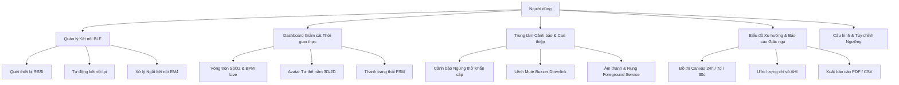

# ĐẶC TẢ YÊU CẦU PHẦN MỀM (SRS) & HƯỚNG DẪN DỰ ÁN
## SOMNIGUARD COMPANION ANDROID APP 📱⚡
**Hệ Thống Giám Sát Giấc Ngủ & Can Thiệp Ngưng Thở Thông Minh (Silicon Labs EFR32MG26 + Android Native)**

---

## 1. TỔNG QUAN HỆ THỐNG (SYSTEM OVERVIEW)

### 1.1. Giới thiệu dự án
**SomniGuard Companion App** là ứng dụng di động Android Native hiện đại được xây dựng bằng **Kotlin**, **Jetpack Compose (Material 3)**, **Room Database** và **Android BLE APIs**. Ứng dụng kết nối trực tiếp với thiết bị đeo tay thông minh **SomniGuard** (nền tảng vi điều khiển *Silicon Labs EFR32MG26*), đóng vai trò là trung tâm giám sát thời gian thực, quản lý cảnh báo ngưng thở khi ngủ (Sleep Apnea), phân tích xu hướng giấc ngủ và điều khiển can thiệp phần cứng.

```
┌────────────────────────────────────────────────────────────────────────┐
│                        THIẾT BỊ ĐEO SOMNIGUARD                         │
│       (EFR32MG26 + MAX30102 + IMU MPU6050 + Motor/Buzzer + BLE)        │
└───────────────────────────────────┬────────────────────────────────────┘
                                    │
                                    │ BLE GATT (Binary Payload 1Hz / Event)
                                    ▼
┌────────────────────────────────────────────────────────────────────────┐
│                     ỨNG DỤNG ANDROID SOMNIGUARD                        │
│ ┌────────────────────────────────────────────────────────────────────┐ │
│ │ UI Layer: Jetpack Compose (Material 3 Dark Theme, Canvas Charts)   │ │
│ ├────────────────────────────────────────────────────────────────────┤ │
│ │ ViewModel & Domain: MVVM, StateFlow, Thuật toán ước lượng AHI      │ │
│ ├────────────────────────────────────────────────────────────────────┤ │
│ │ BLE Engine: GATT Client, Binary Parser, Auto-Reconnect, Alerts     │ │
│ ├────────────────────────────────────────────────────────────────────┤ │
│ │ Storage: Room Database (SQLite), CSV/PDF Report Exporter           │ │
│ └────────────────────────────────────────────────────────────────────┘ │
└────────────────────────────────────────────────────────────────────────┘
```

### 1.2. Mục tiêu kỹ thuật & Trải nghiệm
1. **Truyền nhận dữ liệu thời gian thực (Zero-lag Telemetry):** Đọc và giải mã dữ liệu sinh lý (SpO2, Nhịp tim BPM, Năng lượng vận động Motion Energy, Tư thế nằm Posture, Trạng thái FSM) với tần suất 1Hz, độ trễ hiển thị $\le 50\text{ ms}$.
2. **Cảnh báo khẩn cấp tức thời (Low-Latency Critical Alerts):** Đẩy cảnh báo âm thanh/rung và thông báo đè (Heads-up Notification) trong vòng $< 100\text{ ms}$ khi phát hiện ngưng thở, sụt giảm SpO2 hoặc loạn nhịp tim.
3. **Quản lý nguồn & Bắt tay EM4 (Graceful Power Handshake):** Đồng bộ trạng thái dung lượng pin, nhận biết ngón tay tuột khỏi cảm biến và xử lý đếm ngược khi thiết bị chuyển sang chế độ tắt nguồn siêu tiết kiệm **EM4 (Shutoff Mode)**.
4. **Phân tích giấc ngủ & Xu hướng lâm sàng (Sleep Analytics & Trends):** Tổng hợp chỉ số ngưng thở - giảm thở **AHI (Apnea-Hypopnea Index)**, phân bố tư thế ngủ, biểu đồ SpO2/HR theo các mốc 24 giờ, 7 ngày, 30 ngày.
5. **Hoạt động Offline & Bảo mật:** Toàn bộ dữ liệu được mã hóa và lưu trữ cục bộ bằng Room Database, không bắt buộc kết nối Internet.

---

## 2. KIẾN TRÚC VÀ CÔNG NGHỆ (TECH STACK & ARCHITECTURE)

### 2.1. Ngăn xếp công nghệ (Technology Stack)
* **Ngôn ngữ:** Kotlin 1.9+ (Target JVM 17).
* **Nền tảng tối thiểu:** Android 10 (API level 29) $\rightarrow$ Tối ưu Android 14+ (API level 34+).
* **Kiến trúc mã nguồn:** MVVM (Model-View-ViewModel) kết hợp Clean Architecture & Unidirectional Data Flow (UDF).
* **UI Framework:** Jetpack Compose (Material 3 Dark Theme chuẩn y tế hiện đại).
* **Bất đồng bộ & Luồng dữ liệu:** Kotlin Coroutines, `StateFlow`, `SharedFlow`.
* **Cơ sở dữ liệu:** Room Database (SQLite Abstraction với KSP).
* **Bluetooth Engine:** Android Native `BluetoothLeScanner`, `BluetoothGattCallback`, Coroutine-based GATT Queue.
* **Xử lý đồ họa:** Custom Canvas 2D Renderer (Vẽ biểu đồ sóng mượt mà, hỗ trợ zoom/pan và marker).

### 2.2. Sơ đồ Kiến trúc Phần mềm
```
┌────────────────────────────────────────────────────────────────────────┐
│                          UI LAYER (JETPACK COMPOSE)                    │
│   MainActivity ──> MainScreen ──> DashboardScreen & ScanScreen        │
│                        │                                               │
│                        ▼ (Lắng nghe StateFlow)                         │
├────────────────────────────────────────────────────────────────────────┤
│                         VIEWMODEL LAYER                                │
│                         MainViewModel                                  │
│   (Quản lý trạng thái UI, xử lý tương tác người dùng, bộ lọc thời gian) │
│                        │                                               │
│       ┌────────────────┴────────────────┐                              │
│       ▼                                 ▼                              │
├───────────────────────────────┬────────────────────────────────────────┤
│         BLE ENGINE LAYER      │          DATA / STORAGE LAYER          │
│          BleManager           │            SensorRepository            │
│  (Quét, Kết nối, Nhận gói)   │                   │                    │
│               │               │                   ▼                    │
│               │ (Bắn Stream)  │            AppDatabase                 │
│               └───────────────┼─────────> SensorDataDao                │
│                               │          SensorDataEntity              │
│                               │          AlertEventEntity              │
└───────────────────────────────┴────────────────────────────────────────┘
```

---

## 3. ĐẶC TẢ GIAO THỨC BLE (BLE GATT SPECIFICATION)

### 3.1. Cấu trúc GATT Service & Characteristic

| Service / Characteristic | UUID | Thuộc tính | Kích thước | Mô tả chức năng |
| :--- | :--- | :---: | :---: | :--- |
| **SomniGuard Wearable Service** | `0000FFE0-0000-1000-8000-00805F9B34FB` | - | - | Custom Service chính của thiết bị |
| ├── **Event & Alert** | `0000FFE1-0000-1000-8000-00805F9B34FB` | NOTIFY / INDICATE | 8 Bytes | Kênh đẩy cảnh báo ngưng thở, pin yếu, tuột tay, EM4 |
| ├── **Health Telemetry** | `0000FFE2-0000-1000-8000-00805F9B34FB` | READ / NOTIFY | 12 Bytes | Kênh truyền chỉ số SpO2, HR, Motion, Tư thế định kỳ (1Hz) |
| └── **System Control** | `0000FFE3-0000-1000-8000-00805F9B34FB` | WRITE / WRITE_NO_RESP | 4 - 8 Bytes | Kênh gửi lệnh từ App: Tắt còi, đo thủ công, chỉnh độ nhạy |
| **Battery Service** | `0x180F` | - | - | Service pin chuẩn BLE SIG |
| └── **Battery Level** | `0x2A19` | READ / NOTIFY | 1 Byte | Mức pin tiêu chuẩn (0 - 100%) |
| **Device Information** | `0x180A` | - | - | Thông tin phần cứng & Firmware |

---

### 3.2. Cấu trúc Gói tin Binary (Binary Payload Mapping)

Tất cả gói tin sử dụng thứ tự byte **Little-Endian**, định dạng binary nén chặt không padding.

#### A. Gói tin Định kỳ Sinh lý (Health Telemetry Packet - 12 Bytes - UUID `0xFFE2`)
```
+---------------+---------------+---------------+---------------+
| Byte 0 - 1    | Byte 2 - 3    | Byte 4 - 5    | Byte 6 - 7    |
| Sequence Num  | SpO2 (x100)   | HeartRate(x10)| MotionEnergy  |
+---------------+---------------+---------------+---------------+
| Byte 8        | Byte 9        | Byte 10       | Byte 11       |
| Posture & Flag| Top FSM State | Sub FSM State | Battery %     |
+---------------+---------------+---------------+---------------+
```

* **`seq_num` (`uint16_t`):** Số thứ tự gói (1..65535) phát hiện mất gói tin.
* **`spo2_x100` (`uint16_t`):** $\text{SpO2} = \text{Value} / 100.0\ (\%)$ (Ví dụ: $9750 \rightarrow 97.50\%$).
* **`hr_x10` (`uint16_t`):** $\text{Nhịp tim} = \text{Value} / 10.0\ (\text{BPM})$ (Ví dụ: $725 \rightarrow 72.5\text{ BPM}$).
* **`motion_mg` (`uint16_t`):** Năng lượng vận động (milli-g).
* **`posture_flags` (`uint8_t`):**
  * Bit 0-2: Tư thế (0: Nằm ngửa/Supine, 1: Nằm sấp/Prone, 2: Nghiêng trái/Left, 3: Nghiêng phải/Right, 4: Chưa xác định).
  * Bit 3: Cảm biến ngón tay (1: Đang đeo/Attached, 0: Đã tuột/Removed).
  * Bit 4: Tín hiệu PPG (1: Tốt/Valid, 0: Nhiễu/Invalid).
* **`top_fsm_state` (`uint8_t`):** Trạng thái FSM (0: Inactive, 1: Suspend, 2: Active, 3: Normal Sleep, 4: Deep Analysis).
* **`sub_fsm_state` (`uint8_t`):** Trạng thái can thiệp (0: Idle, 1: Vibration Stage 1, 2: Vibration Stage 2, 3: Alarm Buzzer).
* **`battery_level` (`uint8_t`):** Phần trăm pin (0 - 100%).

---

#### B. Gói tin Sự kiện & Cảnh báo (Event & Alert Packet - 8 Bytes - UUID `0xFFE1`)

| Byte Index | Trường | Kiểu dữ liệu | Mô tả |
| :---: | :--- | :---: | :--- |
| **Byte 0** | `event_type` | `uint8_t` | **0x01**: Health Alert, **0x02**: Sensor Status, **0x03**: Power/System |
| **Byte 1** | `event_code` | `uint8_t` | Chi tiết mã sự kiện (Xem bảng dưới) |
| **Byte 2-3** | `seq_num` | `uint16_t` | Số thứ tự sự kiện |
| **Byte 4-5** | `param1` | `uint16_t` | Tham số bổ trợ 1 (Giá trị SpO2, Mã lỗi, Mức pin, ...) |
| **Byte 6-7** | `param2` | `uint16_t` | Tham số bổ trợ 2 (BPM, Thời gian đếm ngược EM4, ...) |

**Bảng mã sự kiện chính:**
* `0x01 / 0x11` - **`APNEA_WARNING` (CRITICAL):** Cảnh báo phát hiện cơn ngưng thở. `param1`: SpO2 hiện tại ($\times 10$), `param2`: Nhịp tim BPM.
* `0x01 / 0x12` - **`SPO2_CRITICAL` (HIGH):** Sụt giảm oxy máu nghiêm trọng ($< 88\%$).
* `0x02 / 0x21` - **`FINGER_REMOVED` (MEDIUM):** Ngón tay rời khỏi cảm biến. `param1`: Thời gian tuột tay (ms).
* `0x03 / 0x31` - **`BATTERY_LOW` (HIGH):** Cảnh báo pin yếu ($< 15\%$). `param1`: Mức pin %, `param2`: Điện áp mV.
* `0x03 / 0x32` - **`EM4_SHUTOFF` (CRITICAL):** Thiết bị chuẩn bị tắt nguồn vào chế độ ngủ sâu EM4. `param2`: Thời gian đếm ngược (giây).

---

#### C. Gói tin Điều khiển Downlink (System Control Packet - 4 Bytes - UUID `0xFFE3`)

```
+---------------+---------------+-------------------------------+
| Byte 0        | Byte 1        | Byte 2 - 3                    |
| Command ID    | Parameter 1   | Parameter 2 / Checksum        |
+---------------+---------------+-------------------------------+
```

* `0x01`: **Mute Alarm** (Tắt chuông báo động tạm thời). `param1`: Thời gian tắt chuông (giây).
* `0x02`: **Manual Spot-Check** (Yêu cầu đo nhanh SpO2/HR tức thời 30s).
* `0x03`: **Force Enter EM4** (Lệnh yêu cầu thiết bị tắt nguồn an toàn).
* `0x04`: **Set Sensitivity** (Cài đặt độ nhạy thuật toán phát hiện ngưng thở: 1-Thấp, 2-Vừa, 3-Cao).
* `0x05`: **Sync Timestamp** (Đồng bộ thời gian Unix từ điện thoại xuống đồng hồ RTC thiết bị).

---

## 4. ĐẶC TẢ YÊU CẦU CHỨC NĂNG (FUNCTIONAL REQUIREMENTS)



### 4.1. Phân hệ Quản lý Kết nối BLE (BLE & Device Manager)
* **FR-BLE-01 (Quét & Lọc thiết bị):** Tự động quét các thiết bị có `Service UUID: 0xFFE0` hoặc tên bắt đầu bằng `"SomniGuard"`. Hiển thị chỉ số sóng RSSI (dBm) dạng thanh sóng trực quan.
* **FR-BLE-02 (Tự động kết nối lại - Auto Reconnect):** Nếu kết nối bị mất ngoài dự kiến (mất sóng RF), ứng dụng tự động thực hiện Exponential Backoff Reconnect trong nền.
* **FR-BLE-03 (Bắt tay hạ nguồn EM4 - Graceful Disconnect):** Khi nhận được Event `0x32 (EM4_SHUTOFF)`, ứng dụng **không báo lỗi mất kết nối đột ngột**, mà hiển thị Dialog thông báo thiết bị chuẩn bị vào chế độ tắt nguồn và đóng kết nối GATT an toàn.

### 4.2. Phân hệ Giám sát Trực thời (Real-time Telemetry Dashboard)
* **FR-DASH-01 (Hiển thị chỉ số sinh lý):** Cập nhật liên tục 1Hz với hiệu ứng mượt mà (Animated Counter):
  * Nồng độ Oxy trong máu $\text{SpO2}\ (\%)$.
  * Nhịp tim thời gian thực $\text{Heart Rate}\ (\text{BPM})$.
  * Mức độ chuyển động $\text{Motion Energy}\ (\text{mg})$.
* **FR-DASH-02 (Tư thế nằm & Trạng thái ngón tay):**
  * Hiển thị biểu tượng/avatar tư thế: Nằm ngửa (Supine), Nằm sấp (Prone), Nghiêng trái (Left), Nghiêng phải (Right).
  * Hiển thị cảnh báo trực quan nếu cờ `Finger Attached = 0` ("Vui lòng đeo lại vòng cảm biến vào ngón tay").
* **FR-DASH-03 (Trạng thái lâm sàng FSM):** Hiển thị giai đoạn giấc ngủ hiện tại từ MCU: *Thức (Active) $\rightarrow$ Ngủ bình thường (Normal Sleep) $\rightarrow$ Phân tích chuyên sâu (Deep Analysis) $\rightarrow$ Đang can thiệp rung (Intervention)*.
* **FR-DASH-04 (Điều khiển nhanh Downlink):**
  * Nút **"Tắt chuông báo" (Mute Alarm)**: Gửi lệnh downlink `0x01` để ngừng còi buzzer trên thiết bị trong 60 giây.
  * Nút **"Đo nhanh" (Spot-Check)**: Gửi lệnh `0x02`.
  * Nút **"Tắt nguồn" (Power Down)**: Gửi lệnh `0x03` yêu cầu thiết bị vào EM4.

### 4.3. Phân hệ Cảnh báo & Can thiệp (Health Alerts & Emergency Response)
* **FR-ALRT-01 (Độ ưu tiên cảnh báo):**
  * **Critical:** Phát hiện Ngưng thở (`APNEA_WARNING`), SpO2 tụt sâu $< 85\%$. Bật còi báo trên điện thoại với âm lượng tối đa và rung đa nhịp.
  * **High:** Sụt giảm SpO2 nhanh, Loạn nhịp tim, Pin yếu $< 10\%$.
  * **Info / Medium:** Tuột cảm biến, chuyển trạng thái FSM.
* **FR-ALRT-02 (Foreground Service & WakeLock):** Chạy một Android Foreground Service liên tục suốt đêm kèm Notification cố định hiển thị SpO2/HR, giữ kết nối BLE không bị hệ điều hành đóng.

### 4.4. Phân hệ Phân tích Xu hướng & Báo cáo (Trends & Clinical Analytics)
* **FR-TRND-01 (Biểu đồ Canvas tùy biến):** 
  * Biểu đồ đường cong nồng độ Oxy và nhịp tim kết hợp vùng tô dải màu Gradient (Xanh: Bình thường $\ge 95\%$, Vàng: Cảnh báo $90-94\%$, Đỏ: Nguy hiểm $< 90\%$).
  * Đánh dấu các mốc thời gian xảy ra cơn ngưng thở (Apnea Markers) trên đồ thị.
  * Bộ lọc linh hoạt: 24 giờ qua (chi tiết từng phút), 7 ngày, 30 ngày.
* **FR-TRND-02 (Ước lượng chỉ số AHI - Apnea-Hypopnea Index):**
  $$\text{AHI} = \frac{\text{Tổng số biến cố ngưng thở + giảm thở}}{\text{Tổng thời gian ngủ (giờ)}}$$
  * Phân loại mức độ: Bình thường ($<5$), Nhẹ ($5-14$), Vừa ($15-29$), Nặng ($\ge 30$).
* **FR-TRND-03 (Xuất dữ liệu):** Cho phép xuất báo cáo giấc ngủ dưới dạng file **PDF** (chuẩn báo cáo y khoa) hoặc dữ liệu thô **CSV/JSON**.

### 4.5. Phân hệ Chế độ Giả lập (Built-in Demo Simulator)
* **FR-SIM-01:** Cung cấp công tắc "Chế độ Giả lập" trong màn hình Cài đặt, cho phép sinh dữ liệu BLE nhân tạo (mô phỏng cơn ngưng thở, thay đổi nhịp tim, tuột cảm biến) để kiểm thử toàn bộ giao diện và cơ sở dữ liệu khi không có sẵn phần cứng EFR32MG26.

---

## 5. ĐẶC TẢ CƠ SỞ DỮ LIỆU CỤC BỘ (ROOM DATABASE SCHEMA)

```
┌─────────────────────────────────────────────────────────────┐
│                      sensor_telemetry_table                 │
├─────────────────────────────────────────────────────────────┤
│ id (PK, AutoGen)               : Long                       │
│ timestamp                      : Long (Unix Epoch ms)       │
│ session_id                     : String (UUID phiên ngủ)    │
│ spo2                           : Float (Ví dụ: 97.5)        │
│ heart_rate                     : Float (Ví dụ: 72.0)        │
│ motion_energy                  : Int (milli-g)              │
│ posture                        : Int (0:Supine..3:Right)    │
│ finger_attached                : Boolean                    │
│ fsm_state                      : Int                        │
└─────────────────────────────────────────────────────────────┘

┌─────────────────────────────────────────────────────────────┐
│                         alert_events_table                  │
├─────────────────────────────────────────────────────────────┤
│ id (PK, AutoGen)               : Long                       │
│ timestamp                      : Long                       │
│ session_id                     : String                     │
│ event_type                     : Int (0x01..0x03)           │
│ event_code                     : Int (0x11..0x33)           │
│ severity                       : String (CRITICAL/HIGH/...) │
│ spo2_at_alert                  : Float                      │
│ hr_at_alert                    : Float                      │
│ is_acknowledged                : Boolean                    │
└─────────────────────────────────────────────────────────────┘
```

---

## 6. CẤU TRÚC THƯ MỤC SOURCE CODE

```
app/src/main/
├── AndroidManifest.xml
└── java/com/example/blewearable/
    ├── MainActivity.kt                      # Entry point & Permission Launcher
    ├── ble/
    │   ├── BleConstants.kt                  # Cấu hình mã UUID Dịch vụ & Characteristic BLE
    │   ├── BleDeviceModel.kt                # Model biểu diễn thiết bị BLE & RSSI
    │   ├── BleConnectionState.kt            # Trạng thái kết nối (Disconnected/Scanning/Connected...)
    │   └── BleManager.kt                    # Quản lý quét, kết nối GATT & giải mã gói tin Binary
    ├── data/
    │   ├── SensorDataEntity.kt              # Thực thể bảng dữ liệu Room DB
    │   ├── SensorDataDao.kt                 # Truy vấn SQL bất đồng bộ & Gom nhóm xu hướng
    │   ├── AppDatabase.kt                   # Khởi tạo Room Database Singleton
    │   └── SensorRepository.kt              # Xử lý luồng dữ liệu & Thuật toán ước tính AHI
    ├── ui/
    │   ├── theme/                           # Color, Type, Material3 Dark Theme tokens
    │   ├── components/
    │   │   ├── PermissionHandler.kt         # Tự động xin quyền Android 12+ (BLUETOOTH_SCAN/CONNECT)
    │   │   ├── DeviceItem.kt                # Card hiển thị thiết bị BLE kèm chỉ số RSSI
    │   │   └── HistoricalTrendChart.kt      # Biểu đồ xu hướng Canvas tùy biến
    │   └── screens/
    │       ├── ScanScreen.kt                # Màn hình tìm kiếm thiết bị BLE
    │       ├── DashboardScreen.kt           # Màn hình điều khiển, xem chỉ số & biểu đồ
    │       └── MainScreen.kt                # Vỏ ứng dụng chứa Bottom Navigation Bar
    └── viewmodel/
        └── MainViewModel.kt                 # Quản lý StateFlow, UI state & Giả lập Demo
```

---

## 7. HƯỚNG DẪN BUILD & CHẠY ỨNG DỤNG

1. **Mở dự án trong Android Studio:**
   * Khởi động **Android Studio** (phiên bản Hedgehog | 2023.1.1 hoặc mới hơn).
   * Chọn **File > Open...** và trỏ đến thư mục `projects/android-app`.
2. **Đồng bộ Gradle:**
   * Chờ Android Studio hoàn tất quá trình **Gradle Sync** và tải các dependencies.
3. **Cài đặt thiết bị & Cấp quyền:**
   * Kết nối điện thoại Android qua cáp USB (đã bật **USB Debugging**) hoặc chạy Android Emulator (API 30+).
   * Khi mở ứng dụng lần đầu, chọn **Allow / Cho phép** khi hộp thoại xin quyền Bluetooth & Vị trí hiển thị.
4. **Chạy ứng dụng:**
   * Bấm nút **Run ▶** (hoặc tổ hợp phím `Shift + F10`).
   * Chọn thiết bị **SomniGuard-xG26** trong màn hình Quét để bắt đầu kết nối và nhận dữ liệu thời gian thực.
